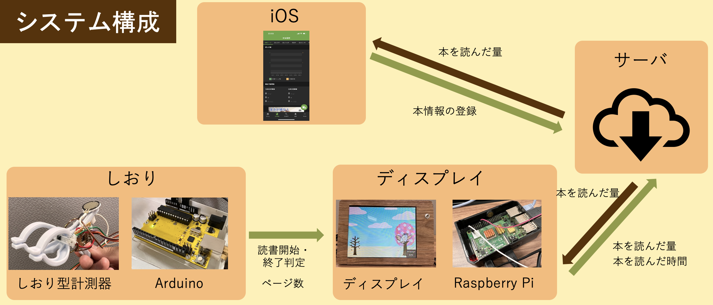
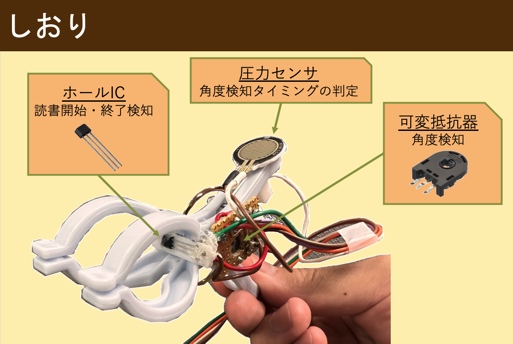
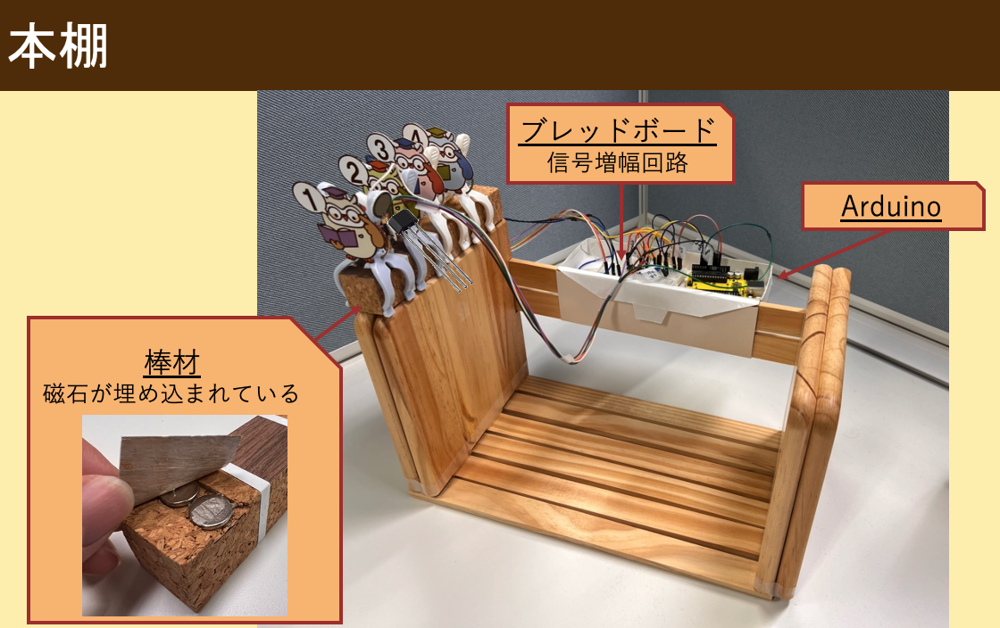
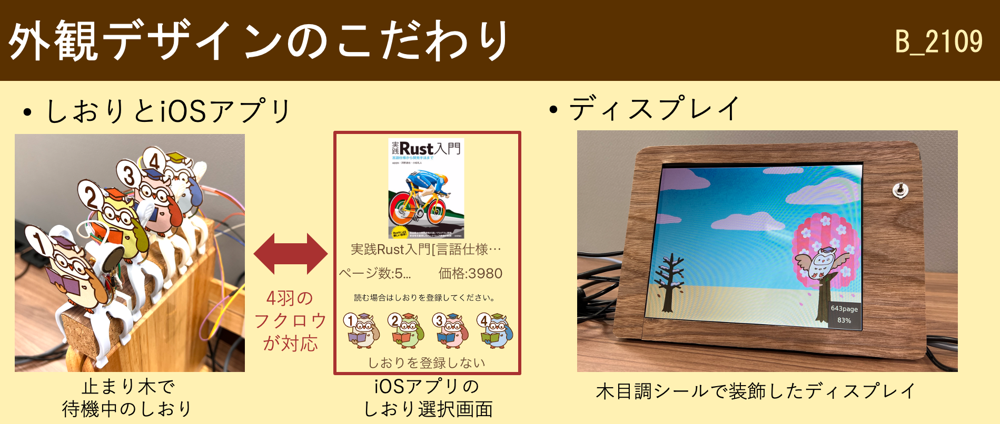
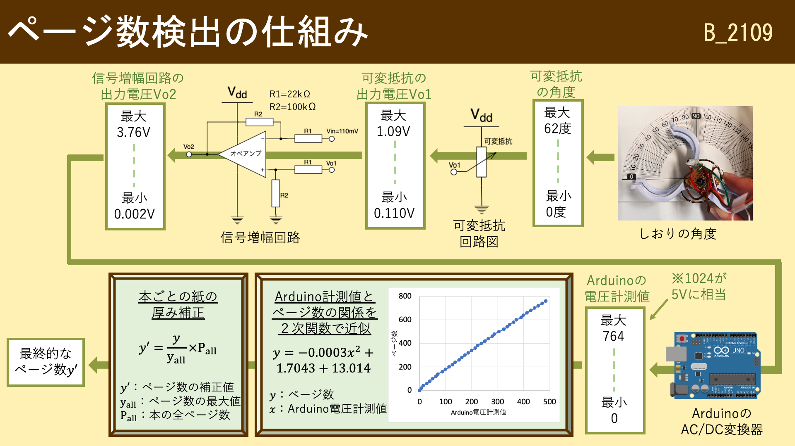

# ブックロウ

## デモ動画

## 製品概要
### 背景(製品開発のきっかけ、課題等）
皆さんはプログラミングの学習本を買ってから，少しだけ読んで本棚の奥にしまっていませんか？
このように本を読みきらずに積んでしまうことを「積ん読」といいます．
特にIT系学生は様々なプログラミング学習本に手を出してしまうため，この問題に陥りやすいです．

これに対して，読書記録や本棚を管理して積ん読を抑制する読書管理アプリ（[Readee](https://readee.rakuten.co.jp"Readee")，[読書メーター](https://bookmeter.com'読書メーター')など）があります．しかし, これらのアプリは読書をする度に読んだページ数を手入力しなければならず，非常に面倒です．

そこで，私達は
情報系の技術本を読むIT系学生を対象に，
1. 積ん読をしてしまう
2. 読書管理アプリの記録入力が面倒

という問題に着目しました．

### 製品説明（具体的な製品の説明）
本にはさむだけで読んだ量を管理できるしおりデバイス「ブックロウ」を開発しました．
加えてこれは，iOSアプリケーションで読書量の目標を設定して，専用のディスプレイで達成状況を確認することができます．

ブックロウは次のような構成要素で成り立っています．

#### しおり
しおりはふくろうの足をイメージしたクリップを使用しており，挟むときの開閉角度の変化を用いて，厚みを検出します．
開閉角度は可変抵抗器という，回転角度を抵抗値に変換する電子部品によって計測しています．
厚さを計測するタイミングは，ユーザがクリップから手を離した一秒後に設定しています．
手を離したことの検知は，持ち手に取り付けられた圧力センサの抵抗値の変化を計測して行っています．

またこのしおりはユーザが読書中であることを検知します．
読書中の状態とはしおりを磁石が埋め込まれた棒材（これはしおりがふくろうを模しているため止まり木と呼んでいます）に挟んでいる状態を指しており，ホールICという磁気センサを用いて磁気の検出をしています．

これらセンサの電気的変化はArduinoと呼ばれるマイコンを用いて計測し，読書状態の判定をしています．

#### 専用本棚
専用本棚にはしおりとArduinoが取り付けられ，管理対象の本を収納します．
また左側には読書中のふくろうの止まり木となる棒材が設置されています．この棒材には磁石が埋め込まれており，読書中の判定に使用されます．

#### 表示機
表示機は二つの役割をもちます．
一つはしおりのデータを処理するArduinoとシリアル通信をし，読書量のデータの取得および，内部で読書の開始と終了時間を取得しひとまとまりのデータに整形して管理サーバに送信します．
もう一つは常駐ディスプレイとして管理サーバから読書量を取得し，描画します．
<!-- todo ふくろうの進んでる写真？ -->

最後は本の登録時に使用する全体の厚さの計測・表示機能です．
これはスイッチにより切り替えられ，切り替え先の画面では各しおりのその時点の厚みの計測結果が表示されています．
ユーザはこの値を本の登録時に目視で読み取り，iOSアプリの所定のフォームに入力するのに使用します．

表示機はRaspberry Piとそれに接続された小型ディスプレイで構成されており，

#### iOSアプリケーション
<!-- todo 池上さんの確認 -->
iOSアプリケーションはユーザが積ん読している本の登録および管理をする役割を果たします．

本の登録では，本を一意に識別できるISBNをスマホで読み取り，操作ユーザのID，しおりから読み取れる本の全体の厚さと共にサーバに送信します．
また，各しおりは特定の本に紐付けますが，この紐付け情報の変更リクエストも管理サーバに送信します．

本情報の取得では，操作ユーザが所持する本情報のリストを管理サーバから取得し，画面に整形して表示します．

#### 管理サーバー
管理サーバは本情報，しおりと本の紐付け情報，読書記録，ユーザ情報といったブックロウが扱う全ての情報の管理，および表示機もしくはiOSアプリからの情報取得・更新といったリクエストの受付を行います．
管理サーバはGoで実装されており，データはMySQLに保存しています．

### 使用手順
1. 本の登録
    * iOSアプリの登録ボタンを押すとバーコードリーダーが起動するので，登録したい本のバーコードを読み取る．
    * 本全体の厚みを入力する．本全体をしおりではさみ，ディスプレイのスイッチを操作してモードを切り替えると本の厚み情報がディスプレイに表示される．その数値をiOSアプリに入力すると本の登録が完了する．
2. しおりを割当てる
    * iOSアプリのしおり割当てボタンを押すとしおりの選択ボタンがあるので，空いているしおりの番号を選択する．
    * 本のゼロページ目にしおりをはさむ
3. 読書する
    * しおりを本から取り外し，棚の横にある止まり木に取り付ける．
4. しおりをはさむ
    * しおりを止まり木から外し，今回読んだページまではさむ．
    * しおりが読書した時間とページ数を検知し，サーバに読書量や読書時間で構成される読書記録をアップロードする．
5. 読書終了
    * 3と4を繰り返して本を読み終わった場合，iOSで読書が終了したことを登録する．

### 特長
1. 読書後にしおりを挟むだけでページ数と読書時間が自動的に計測されて記録されます．
2. 専用ディスプレイに積ん読本の総ページ数と読み終えたページ数が，かわいいグラフィックとともに表示されます．
3. iOSアプリを用いて新しい本の登録や，ある期間での目標読書ページ数を設定することができます．

### 解決出来ること
ブックロウを使えば，これまで面倒であった読書記録や本棚の管理が簡単にできるようになります．
これによりユーザは積ん読の状況を簡単に把握できるようになり，積ん読本を減らそうとするモチベーションを上げることができます．

### 今後の展望
 - 登録している本をカテゴリ分けし，ユーザがカテゴリごとに積ん読本の管理をできるようにする．
 - 現在のしおりは有線でArduinoに接続されているため，有線コードの長さで本の置き場所が制限されてしまう．そこで各しおりにバッテリーとBluetoothを搭載して無線化し，専用の本棚に依存せずに管理できるようにする．
 - 表示機にコンシェルジュのような役割を果たすキャラクターを登場させ，長く積まれている本のサジェストや，目標の提案や，設定した目標に基づいて読むことを促す言葉をかける機能をもたせる．

### 注力したこと（こだわり等）
1. 読書情報の自動記録
 - しおりは各種センサによって読書したページ数と，読書の開始と終了のタイミングを検知します．
 - その情報を元に読書を終えると自動で読書の記録をサーバにアップロードすることで，ユーザの手を煩わせないようにしました．
2. おしゃれな外観
 - ブックロウは据え置き型のデバイスです．ユーザがインテリアの一部として設置したいと思えるように，木目調のおしゃれなデザインで統一しました．
 - アプリ，しおり，ディスプレイ表示の各所に，ふくろうのデザインを取り入れています．これによって暖かみのあるデザインとなり，ユーザから愛着をもって使ってもらえるようにしました．

3. サーバーにおけるgRPCを使用したスキーマファーストの開発
 - 仕様書を作成し，その仕様書からコードを生成することで，仕様と実際の動作の差異をなくすことができる．
 - 仕様書によってクライアント―サーバー間の通信が詳細に定義されることで，クライアントはサーバーの実装を待たずに通信部分の開発をすすめることができる．これによりサーバとクライアントの開発の分離度を向上させることができる．
4. GitHub Actionsを活用した継続的インテグレーションの実現
 - コードをGitHubにアップロードした時点でテストを自動的に実行するよう設定することで，開発者は機能開発に集中しながら，一定のプログラムの安定性を保証するようにした．
5. 本の情報を簡単に登録できるように，iOSアプリケーションでバーコードリーダーとしての機能を実装し，キーボード入力無しで本を登録できるように実装した．

## 開発技術
### 活用した技術
#### API・データ
* API
    * OpenBD : ISBNから書誌情報を取得可能なAPI

#### フレームワーク・ライブラリ・モジュール
* ディスプレイ
    * TKinter：画面描画モジュール
    * PySerial：シリアル通信モジュール
* iOS
    * SwiftUI : SwiftでUIを記述するためのフレームワーク
    * Swift gRPC : SwiftでGRPCを実装するためのライブラリ
    * PagerTabStripView : SwiftUIに特化したPagerView
    * AVFoundation : カメラや音声などを扱うモジュール
* サーバ
    * gRPC：提供APIの仕様定義及び，サーバクライアント間の通信インタフェースとなるソースコードの生成
    * Go：サーバプログラムの作成
    * MySQL：データの保管
    * Docker，docker-compose：サーバープログラムの実行環境構築

#### デバイス
* 表示機
    * 画面描画，サーバ・Arduinoとの通信：Raspberry Pi4
    * ディスプレイ：8インチHDMIマルチモニター 
    * スイッチ：1回路２接点 トグルスイッチ MS-610A(3P)
* しおり
    * センサ読み取り，Raspberry Piとの通信：Arduino Uno互換機 Switch Science What's Next
    * しおりのクリップ部分：洗濯バサミ
    * 角度センサ：アルプスアルパイン社製 抵抗式ポジションセンサRDC501051A
    * 圧力センサ：FSR402 Short Tail
    * 磁気センサ：リニアホールIC SS49E
    * 信号増幅器：LM324AN

### 独自技術
#### ハッカソンで開発した独自機能・技術
##### しおり型計測器のページ数検出技術
<!-- * 独自で開発したものの内容をこちらに記載してください -->
<!-- * 特に力を入れた部分をファイルリンク、またはcommit_idを記載してください。-->
本の一般的な紙の厚さは0.13mmであるため，ページ数を検出する計測器には極小寸法を計測できる測定精度が必要になります．
厚みゲージやノギスといった計測器具であればこのような極小寸法を計測することができますが，使用には専門知識と手間が必要です．
対して我々のプロダクトは手軽に読書記録をつけられることが魅力であるため，それらの煩雑な計測器具は適しません．
そこで我々は一からしおり型計測器を開発しました．

始めに，ハードウェアとなるクリップに関して様々な種類を試しました．
その結果，色々な挟み方をしても計測値の変化が少ない「洗濯バサミ」を採用しました．
しかし洗濯バサミは簡素なつくりであるため，関節部のガタツキが大きく計測精度を悪化させてしまいます．
そこで極小金属パイプ（直径2 mm）や極小金属ネジ（M2サイズ）を使用して，各部の取り付け剛性を確保しました．

次にしおり型計測器の開閉角度から，どのようにページ数を検出しているかを説明します．
ページ数は次に説明する6つの段階を経て算出されます．
1. 可変抵抗を回転させる

    本にしおりをはさむと，洗濯バサミの開閉角度が大きくなります．
    すると洗濯バサミに埋め込んだ軸が可変抵抗を回転させ，洗濯バサミと同じ角度だけ回転します．
2. 可変抵抗の出力電圧が変化する

    可変抵抗の両端には5Vの電圧がかけられており，回転すると出力電圧が変化します．
    今回の角度変化は0〜62度であり，それに伴って変化する出力電圧は0.110 V〜1.09 Vとなりました．

3. 信号増幅回路で電圧変化を増幅する

    しかし，後述のArduinoの性能では，1 V程度の電圧変化では正確に電圧を測定することができません．
    そこでオペアンプによる差分増幅回路を用いて電圧変化を3.7倍（0.002 V〜3.76 Vの範囲）に増幅しました．
    こうすることで，増幅回路がない状態に比べて測定精度を3.7倍に引き上げることに成功しました．
4. Arduinoで電圧変化を計測する

    Arduinoのアナログ入力ピンで信号増幅回路の出力電圧を計測します．
    Arduinoは5 Vを1024段階で計測することができます．
    今回の信号増幅回路の電圧変化に対しては，Arduinoの電圧計測値は0〜764段階まで変化します．
    以降，この段階値をArduino電圧測定値と呼称します．
5. 電圧値をページ数に近似する

    前項では洗濯バサミの開閉角度を電圧変化に変換し，Arduinoで計測するところまでやりました．
    しかし開閉角度とページ数は比例の関係ではありません．
    またページ数が多くなればなるほど，紙は洗濯バサミのバネによって圧縮されて，開閉角度の増加は緩やかになります．
    そのため，開閉角度とページ数は非線形の関係となり，それを予測することは困難です．

    そこで我々はArduino電圧測定値とページ数の関係のデータを36点にわたって測定しました（下図のグラフ参照）．
    そしてExcelの近似関数を求める機能を利用して，Arduino電圧測定値からページ数を求める２次関数を求めました．これにより，洗濯バサミの開閉角度からページ数に変換することができました．
6. ページ数を紙の厚みで補正する

    本によって紙の厚みが異なるので，開閉角度からページ数を求めるのには限界があります．
    そこで本の登録時に本全体をはさんだときの計測値（y_all）を取得しておき，ページ数を求める際は現在の測定値(y）との割合y / y_allを求めます．
    これに本の全ページ数（P_all）を乗算することで，ページ数の補正値 y' = (y / y_all) * P_all を求めました．

    本を登録する際に，本全体をしおりではさんで，ディスプレイに表示される計測値（y_all）をiOSアプリに入力するのはこのためです．（[デモ動画の1:29〜2:04参照](https://youtu.be/yoWo9el3d8k?t=89)）

以上の6つの段階を経て，しおり型計測器はページ数を検知しています．
読み取り精度に関しては，770ページの本を計測したときにArduino電圧測定値が0〜485段階に変化しているため，分解能は　770ページ ÷ 486段階 = 約1.6 [ページ/段階]　となります．したがって，理論的には770ページのうち1.6ページまでを区別して測定できることになります．
ただし，洗濯バサミのはさむ場所や角度，本の状態によって測定結果は変化してしまうため，より測定の誤差は大きくなります．しかし本プロダクトの魅力は手軽にページ数を検出する点にあるため，その用途においては十分な精度になっています．

<!-- #### 製品に取り入れた研究内容（データ・ソフトウェアなど）（※アカデミック部門の場合のみ提出必須）
* 
*  -->
