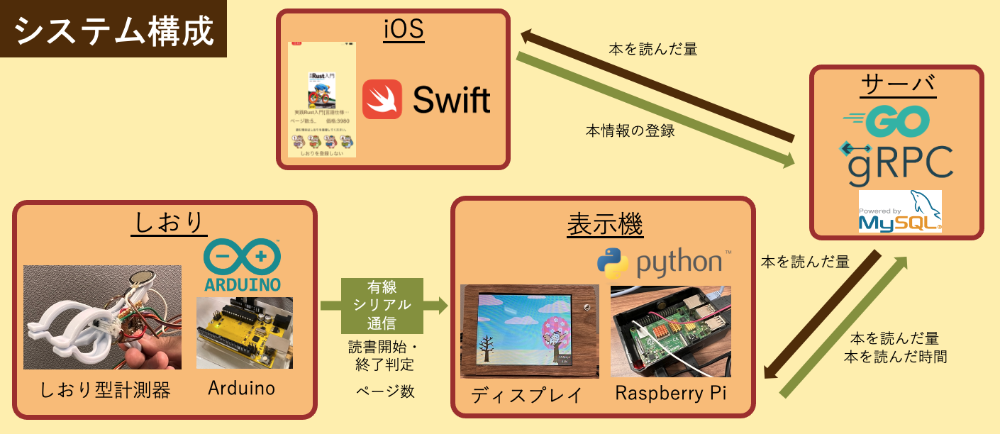

# ブックロウ

## デモ動画

## 製品概要
### 背景(製品開発のきっかけ、課題等）
皆さんはプログラミングの学習本を買ってから，少しだけ読んで本棚の奥にしまっていませんか？
このように本を読みきらずに積んでしまうことを「積ん読」といいます．
特にIT系学生は様々なプログラミング学習本に手を出してしまうため，この問題に陥りやすいです．

これに対して，読書記録や本棚を管理して積ん読を抑制する読書管理アプリ（[Readee](https://readee.rakuten.co.jp"Readee")，[読書メーター](https://bookmeter.com'読書メーター')など）があります．しかし, これらのアプリは読書をする度に読んだページ数を手入力しなければならず，非常に面倒です．

そこで，私達は
情報系の技術本を読むIT系学生を対象に，
1. 積ん読をしてしまう
2. 読書管理アプリの記録入力が面倒

という問題に着目しました．

### 製品説明（具体的な製品の説明）
本にはさむだけで読んだ量を管理できるしおりデバイス「ブックロウ」を開発しました．
加えてこれは，iOSアプリケーションで読書量の目標を設定して，専用のディスプレイで達成状況を確認することができます．

ブックロウは次のような構成要素で成り立っています．

#### しおり
しおりはふくろうの足をイメージしたクリップを使用しており，挟むときの開閉角度の変化を用いて，厚みを検出します．
開閉角度は可変抵抗器という，回転角度を抵抗値に変換する電子部品によって計測しています．
厚さを計測するタイミングはクリップから手を離して一秒後に設定しています．
手を離したことの検知は，持ち手に取り付けられた圧力センサの抵抗値の変化によって行っています．

またこのしおりはユーザが読書中であることを検知します．
読書中の状態とはしおりを磁石が埋め込まれた棒材（これはしおりがふくろうを模しているため止まり木と呼んでいます）に挟んでいる状態を指しており，ホールICという磁気センサを用いて磁気の検出をしています．

これらの電気的変化はArudinoと呼ばれるマイコンを用いて，計測，読書状態の判断をしています．

#### 専用本棚
しおりとArudinoが取り付けられ，管理対象の本を収納します．

#### 表示機
表示機は二つの役割をもちます．
一つはしおりのデータを処理するArudinoとシリアル通信をし，読書量のデータの取得および，内部で読書の開始と終了時間を取得しひとまとまりのデータに整形して管理サーバに送信します．
もう一つは常駐ディスプレイとして管理サーバから読書量を取得し，描画します．
<!-- todo ふくろうの進んでる写真？ -->

最後は本の登録時に使用する全体の厚さの計測・表示機能です．
これはスイッチにより切り替えられ，切り替え先の画面では各しおりのその時点の厚みの計測結果が表示されています．
ユーザはこの値を本の登録時に目視で読み取り，iOSアプリの所定のフォームに入力するのに使用します．

表示機はRaspberry Piとそれに接続された小型ディスプレイで構成されており，

#### iOSアプリケーション
<!-- todo 池上さんの確認 -->
iOSアプリケーションはユーザが積ん読している本の登録および管理をする役割を果たします．

本の登録では，本を一意に識別できるISBNをスマホで読み取り，操作ユーザのID，しおりから読み取れる本の全体の厚さと共にサーバに送信します．
また，各しおりは特定の本に紐付けますが，この紐付け情報の変更リクエストも管理サーバに送信します．

本情報の取得では，操作ユーザが所持する本情報のリストを管理サーバから取得し，画面に整形して表示します．

#### 管理サーバー
管理サーバは本情報，しおりと本の紐付け情報，読書記録，ユーザ情報といったブックロウが扱う全ての情報の管理，および表示機もしくはiOSアプリからの情報取得・更新といったリクエストの受付を行います．
管理サーバはGoで実装されており，データはMySQLに保存しています．

### 使用手順
1. 本の登録
    * iOSアプリの登録ボタンを押すとバーコードリーダーが起動するので，登録したい本のバーコードを読み取る．
    * 本全体の厚みを入力する．本全体をしおりではさみ，ディスプレイのスイッチを操作してモードを切り替えると本の厚み情報がディスプレイに表示される．その数値をiOSアプリに入力すると本の登録が完了する．
2. しおりを割当てる
    * iOSアプリのしおり割当てボタンを押すとしおりの選択ボタンがあるので，空いているしおりの番号を選択する．
    * 本のゼロページ目にしおりをはさむ
3. 読書する
    * しおりを本から取り外し，棚の横にある止まり木に取り付ける．
4. しおりをはさむ
    * しおりを止まり木から外し，今回読んだページまではさむ．
    * しおりが読書した時間とページ数を検知し，サーバに読書量や読書時間で構成される読書記録をアップロードする．
5. 読書終了
    * 3と4を繰り返して本を読み終わった場合，iOSで読書が終了したことを登録する．

### 特長
1. 読書後にしおりを挟むだけでページ数と読書時間が自動的に計測されて記録されます．
2. 専用ディスプレイに積ん読本の総ページ数と読み終えたページ数が，かわいいグラフィックとともに表示されます．
3. iOSアプリを用いて新しい本の登録や，ある期間での目標読書ページ数を設定することができます．

### 解決出来ること
ブックロウを使えば，これまで面倒であった読書記録や本棚の管理が簡単にできるようになります．
これによりユーザは積ん読の状況を簡単に把握できるようになり，積ん読本を減らそうとするモチベーションを上げることができます．

### 今後の展望
 - 登録している本をカテゴリ分けし，ユーザがカテゴリごとに積ん読本の管理をできるようにする．
 - 現在のしおりは有線でArduinoに接続されているため，有線コードの長さで本の置き場所が制限されてしまう．そこで各しおりにバッテリーとBluetoothを搭載して無線化し，専用の本棚に依存せずに管理できるようにする．
 - 表示機にコンシェルジュのような役割を果たすキャラクターを登場させ，長く積まれている本のサジェストや，目標の提案や，設定した目標に基づいて読むことを促す言葉をかける機能をもたせる．

### 注力したこと（こだわり等）
1. 読書情報を自動で記録する点．
 - しおりは圧力センサと磁気センサを用いて，読書の開始と終了を検知します．
 - 読書を終えると自動で読書の記録をサーバにアップロードするため，ユーザの手をわずらわせることはありません．
2. ページ数をできるかぎり正確に検知する点．
 - しおりはクリップ形状になっており，しおりをはさんだときの開度を可変抵抗で読み取ることで本の厚みを検知し，ページ数を算出しています．
 - より正確にページ数を測定するために，オペアンプによる信号増幅回路を持ちいて角度の読み取り精度を3.7倍に引き上げました．さらに，センサ値と理論値を一致させるために２次関数近似を用いた補正をしています．
3. おしゃれな外観を与えました
 - ブックロウは据え置き型のデバイスです．ユーザのインテリアの一部としても設置できるように，木目調のデザインで統一しました．
 - アプリ，しおり，ディスプレイの表示に
<!-- todo 表示機の拡大写真？ -->
4. サーバーにおけるgRPCを使用したスキーマファーストの開発
 - 仕様書を作成し，その仕様書からコードを生成することで，仕様と実際の動作の差異をなくすことができる．
 - 仕様書によってクライアント―サーバー間の通信が詳細に定義されることで，クライアントはサーバーの実装を待たずに通信部分の開発をすすめることができる．これによりサーバとクライアントの開発の分離度を向上させることができる．
 5. GitHub Actionsを活用した継続的インテグレーションの実現
 - コードをGitHubにアップロードした時点でテストを自動的に実行するよう設定することで，開発者は機能開発に集中しながら，一定のプログラムの安定性を保証するようにした．
 6. 本の情報を簡単に登録できるように，iOSアプリケーションでバーコードリーダーとしての機能を実装し，キーボード入力無しで本を登録できるように実装した．

## 開発技術
### 活用した技術
#### API・データ
* API
    * OpenBD : 書誌情報を取得可能なAPI

#### フレームワーク・ライブラリ・モジュール
* ディスプレイ
    * TKinter：画面描画モジュール
    * PySerial：シリアル通信モジュール
* iOS
    * SwiftUI : SwiftでUIを記述するためのフレームワーク
    * Swift gRPC : SwiftでGRPCを実装するためのライブラリ
    * PagerTabStripView : SwiftUIに特化したPagerView
    * AVFoundation : カメラや音声などを扱うモジュール
* サーバ
    * gRPC：提供APIの仕様定義及び，サーバクライアント間の通信インタフェースとなるソースコードの生成
    * Go：サーバプログラムの作成
    * MySQL：データの保管
    * Docker，docker-compose：サーバープログラムの実行環境構築

#### デバイス
* 表示機
    * 画面描画，サーバ・Arduinoとの通信：Raspberry Pi4
    * ディスプレイ：8インチHDMIマルチモニター 
    * スイッチ：1回路２接点 トグルスイッチ MS-610A(3P)
* しおり
    * センサ読み取り，Raspberry Piとの通信：Arduino Uno互換機 Switch Science What's Next
    * しおりのクリップ部分：洗濯バサミ
    * 角度センサ：アルプスアルパイン社製 抵抗式ポジションセンサRDC501051A
    * 圧力センサ：FSR402 Short Tail
    * 磁気センサ：リニアホールIC SS49E
    * 信号増幅器：LM324AN

### 独自技術
#### ハッカソンで開発した独自機能・技術
<!-- todo しおりデバイスの開発秘話 -->
* 独自で開発したものの内容をこちらに記載してください
* 特に力を入れた部分をファイルリンク、またはcommit_idを記載してください。
    * しおりセンサの開発
    *  

<!-- #### 製品に取り入れた研究内容（データ・ソフトウェアなど）（※アカデミック部門の場合のみ提出必須）
* 
*  -->
