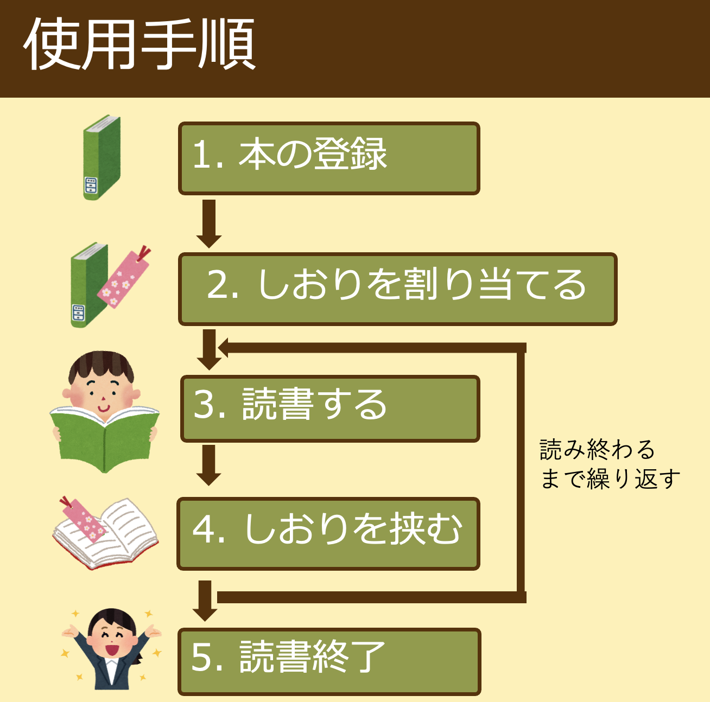

# ブックロウ

## デモ動画

## 製品概要
### 背景(製品開発のきっかけ、課題等）
皆さんはプログラミングの学習本を買ってから，少しだけ読んで本棚の奥にしまっていませんか？このように本を読みきらずに積んでしまうことを「積ん読」といいます．特にIT系学生は様々なプログラミング学習本に手を出してしまうため，この問題に陥りやすいです．

これに対して，読書記録や本棚を管理して積ん読を抑制する読書管理アプリ（[Readee](https://readee.rakuten.co.jp"Readee")，[読書メーター](https://bookmeter.com'読書メーター')など）があります．しかしこれは読書をする度に読んだページ数を手入力しなければならず，非常に面倒です．

私達はこういった，
プログラミング本を読むIT系学生を対象として，
1. 積ん読をしてしまう
2. 読書管理アプリの記録入力が面倒

という問題に着目しました．

### 製品説明（具体的な製品の説明）
本にはさむだけで積んでいる本の量と読んだ量を管理できるしおり「ブックロウ」を作成しました．加えてこれは，iOSアプリで読書量の目標を設定して，専用のディスプレイで達成状況を確認することができます．

### 使用手順
1. 本の登録
    * iOSアプリの登録ボタンを押すとバーコードリーダーが起動するので，登録したい本のバーコードを読み取る．
    * 本全体の厚みを入力する（システム内部のページ数計算に必要）．本全体をしおりではさみ，ディスプレイのスイッチを操作してモードを切り替えると本の厚み情報がディスプレイに表示される．その数値をiOSアプリに入力すると本の登録が完了する．
2. しおりを割当てる
    * iOSアプリのしおり割当てボタンを押すとしおりの選択ボタンがあるので，空いているしおりの番号を選択する．
    * 本のゼロページ目にしおりをはさむ
3. 読書する
    * しおりを取り外し，棚の横にある止まり木に取り付ける．（しおりは止まり木に埋め込まれている磁石の磁力をセンサで検知して読書が開始されたと判断する）
4. しおりをはさむ
    * しおりを止まり木から外し，今回読んだページまではさむ．
    * しおりが読書した時間とページ数を検知し，サーバに読書記録をアップロードする．
5. 読書終了
    * 3と4を繰り返して本を読み終わった場合，iOSで読書が終了したことを登録する．

### 特長
1. 読書後にしおりを挟むだけでページ数と読書時間が自動的に計測されて記録されます
2. 専用ディスプレイに積ん読本の総ページ数と読み終えたページ数が，かわいいグラフィックとともに表示されます
3. iOSアプリを用いて新しい本の登録や，ある期間での目標読書ページ数を設定することができます．

### 解決出来ること
ブックロウを使えば，これまで面倒であった読書記録や本棚の管理が簡単にできるようになります．
これによりユーザは積ん読の状況を簡単に把握できるようになり，積ん読本を減らそうとするモチベーションを上げることができます．
### 今後の展望
 - 登録している本をカテゴリ分けし，ユーザがカテゴリごとに積ん読本の管理をできるようにする．
 - 現在はユーザ1人のみしか対応していないが，これを多数人に拡張する．
 - 現在のしおりは有線でArduinoに接続されているため，有線コードの長さで本の置き場所が制限されてしまう．そこで各しおりにバッテリーとBluetoothを搭載して無線化し，本がどこにあっても管理できるようにする．
### 注力したこと（こだわり等）
1. 読書情報を自動で記録します
 - しおりは圧力センサと磁気センサを用いて，読書の開始と終了を検知します．
 - 読書を終えると自動で読書の記録をサーバにアップロードするため，ユーザの手をわずらわせることはありません．
2. ページ数をできるかぎり正確に検知します
 - しおりはクリップ形状になっており，しおりをはさんだときの開度を可変抵抗で読み取ることで本の厚みを検知し，ページ数を算出しています．
 - より正確にページ数を測定するために，オペアンプによる信号増幅回路を持ちいて角度の読み取り精度を3.7倍に引き上げました．さらに，センサ値と理論値を一致させるために２次関数近似を用いた補正をしています．
3. おしゃれな外観を与えました
 - ブックロウは据え置き型のデバイスです．ユーザのインテリアの一部としても設置できるように，木目調のデザインで統一しました．
 - アプリ，しおり，ディスプレイの表示に
4. サーバーにおけるgRPCを使用したスキーマファーストの開発
 - 仕様書を作成し，その仕様書からコードを形成することで，仕様と実際の動作の差異をなくすことができる．
 - 仕様書によってクライアント―サーバー間の通信が詳細に定義されることで，クライアントはサーバーの実装を待たずに通信部分の開発をすすめることができる．これによりサーバとクライアントの開発の分離度を向上させることができる．

## 開発技術
### システムの構成

### 活用した技術
#### API・データ

#### フレームワーク・ライブラリ・モジュール
* ディスプレイ
    * TKinter：画面描画モジュール
    * PySerial：シリアル通信モジュール
* iOS
    * SwiftUI : SwiftでUIを記述するためのフレームワーク
    * Swift gRPC : SwiftでGRPCを実装するためのライブラリ
    * PagerTabStripView : SwiftUIに特化したPagerView
* サーバ
    * gRPC：提供APIの仕様定義及び，サーバクライアント間の通信インタフェースとなるソースコードの生成
    * Go：サーバプログラムの作成
    Docker，docker-compose：サーバープログラムの実行環境構築

#### デバイス
* ディスプレイ
    * 画面描画，サーバ・Arduinoとの通信：Raspberry Pi4
    * ディスプレイ：8インチHDMIマルチモニター 
    * スイッチ：1回路２接点 トグルスイッチ MS-610A(3P)
* しおり
    * センサ読み取り，Raspberry Piとの通信：Arduino Uno互換機 Switch Science What's Next
    * しおりのクリップ部分：洗濯バサミ
    * 角度センサ：アルプスアルパイン社製 抵抗式ポジションセンサRDC501051A
    * 圧力センサ：FSR402 Short Tail
    * 磁気センサ：リニアホールIC SS49E
    * 信号増幅器：LM324AN

### 独自技術
#### ハッカソンで開発した独自機能・技術
* 独自で開発したものの内容をこちらに記載してください
* 特に力を入れた部分をファイルリンク、またはcommit_idを記載してください。

#### 製品に取り入れた研究内容（データ・ソフトウェアなど）（※アカデミック部門の場合のみ提出必須）
* 
* 
